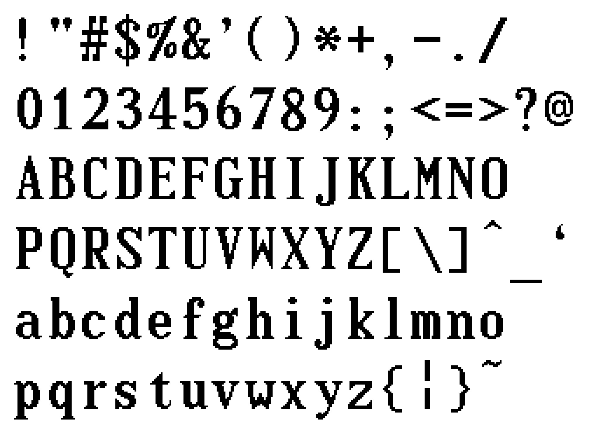

# Decker Fonts
 More fonts for [Decker](https://github.com/JohnEarnest/Decker)

[Decker](https://github.com/JohnEarnest/Decker) is an interactive media platform in the spirit of HyperCard. This is a collection of fonts that you can use in your own decks by dropping the `.deck` file onto your deck and selecting the font to import.

The deck itself can also be opened with Decker and contains an awesome font-editor by John Earnest, which lets you customize the fonts or add your own!

## fonts.deck
This deck cincludes the following fonts

### Standard fonts by [John Earnest](https://github.com/JohnEarnest)
- **body**, compact UI font of Decker

- **menu**, bolder font used in menus

- **mono**, small monospaced font

- **deckbuilder**, bold large slab font

- **olympiad**, serif font

- **olympiad_italic**, _italic_ serif font

- **olympiad_title**, large serif font

### Custom fonts by [1jss](https://github.com/1jss)
**compact**, a compact sans serif font

**typewriter**, a rounded larger serif font

**curseve**, a [_cursive_](https://en.wikipedia.org/wiki/Cursive) font

### Monospace fonts converted by [ktye](https://github.com/ktye) 
**f10x20**, a 10x20 px monospaced font

**f16x32**, a 16x32 px monospaced font

**vt220**, a monospaced font with scan-lines effect

**zevv**, a thin 8x16 px monospaced font

**lucx11**, a 6x11 px monospaced font

**lucx13** a 7x13 px monospaced font

## iconfonts.deck
Custom icons by [1jss](https://github.com/1jss)
**sweet-sixteen** (Work in progress)

